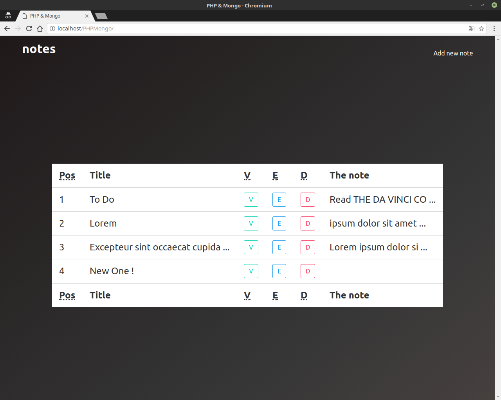
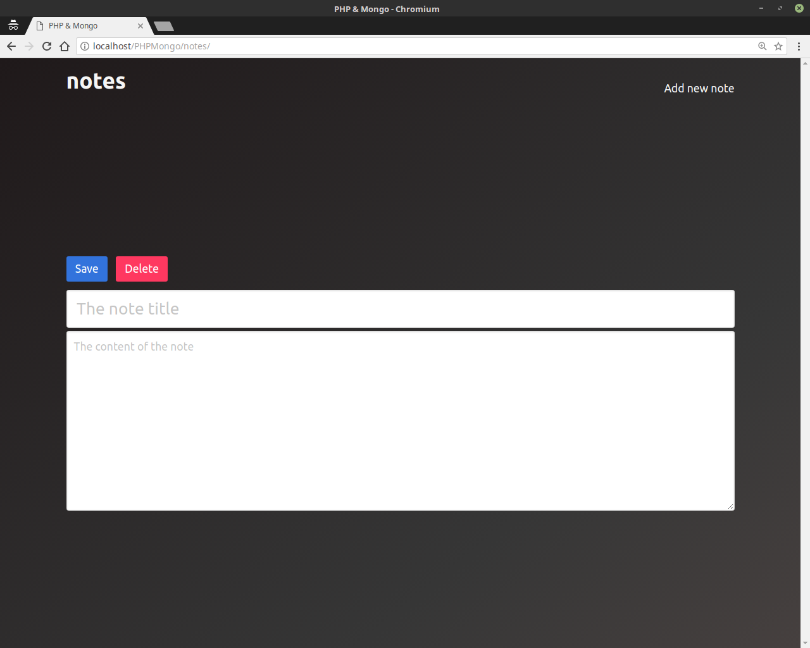
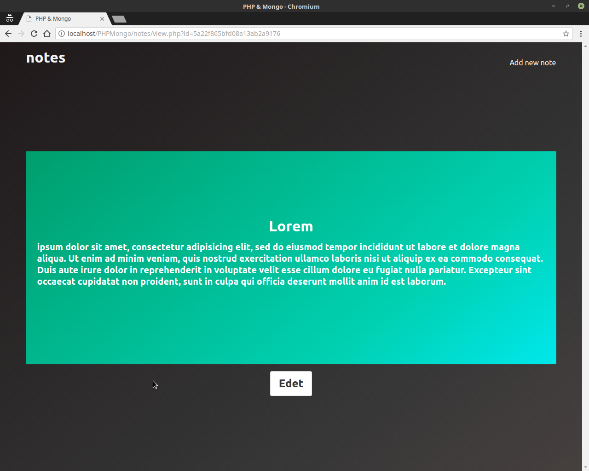
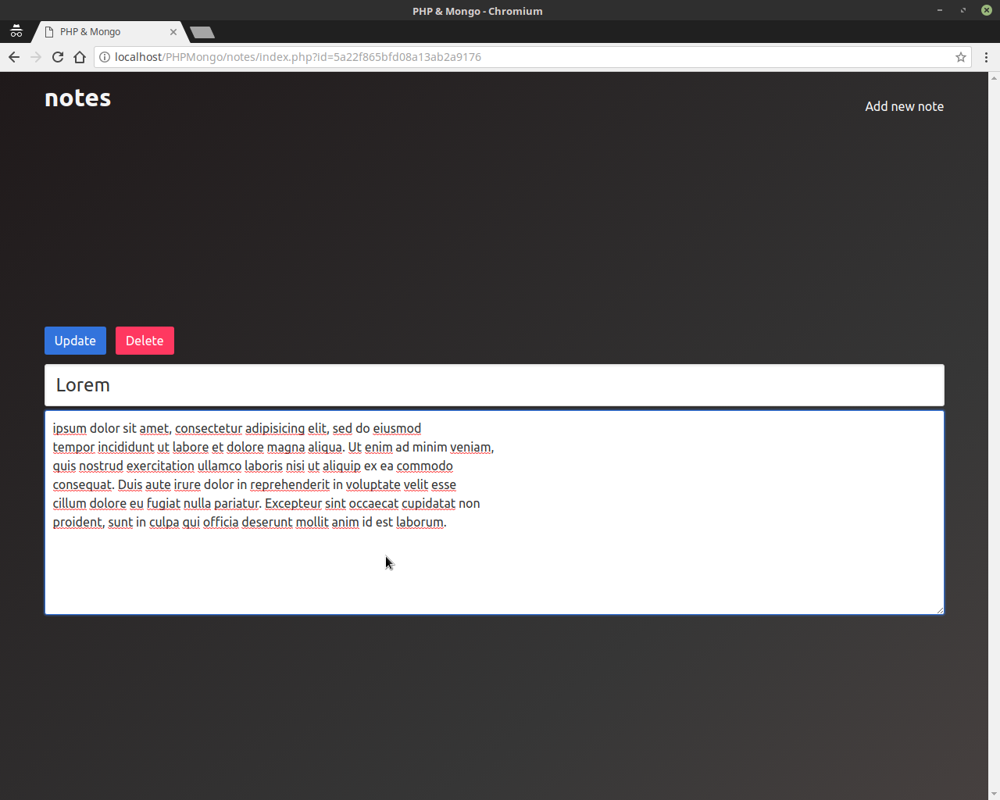

# notes-mongo-php

This Project uses php and mongodb to manage your notes

## Home Page

## Add Note Page

## View Page

## Update Page

Installation guide for mongo-php
[https://github.com/mongodb/mongo-php-library](https://github.com/mongodb/mongo-php-library)

Some useful links for Mongo & PHP

[http://php.net/manual/en/set.mongodb.php](http://php.net/manual/en/set.mongodb.php)

[https://docs.mongodb.com/manual/tutorial/insert-documents/](https://docs.mongodb.com/manual/tutorial/insert-documents/)

## License

This code is under [the MIT license](https://github.com/Moath-Zaghdad/notes-mongo-php/blob/master/LICENSE).
